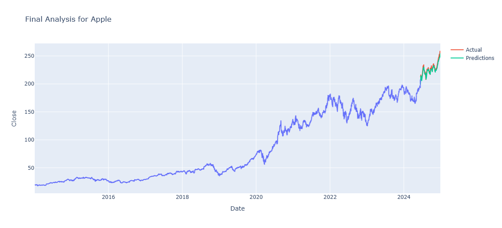

# StockPredictionLSTM
# Apple Stock Price Prediction Using LSTM

This repository contains an implementation of a Long Short-Term Memory (LSTM) model to predict Apple Inc.'s stock prices based on historical data. LSTMs are well-suited for time-series forecasting due to their ability to learn and remember long-term dependencies in sequential data.

## Table of Contents
- [Overview](#overview)
- [What is LSTM?](#what-is-lstm)
- [Project Workflow](#project-workflow)
- [Dataset](#dataset)
- [Model Architecture](#model-architecture)
- [Installation](#installation)
- [Usage](#usage)
- [Results](#results)
- [Contributing](#contributing)
- [License](#license)

## Overview
This project demonstrates the application of an LSTM model to predict Apple stock prices based on historical data. The model uses past stock prices to learn temporal patterns and make future predictions. The workflow involves data preprocessing, LSTM model training, evaluation, and visualization of results.

---

## What is LSTM?
**Long Short-Term Memory (LSTM)** is a type of recurrent neural network (RNN) designed to handle sequential data and overcome the vanishing gradient problem associated with traditional RNNs. LSTMs are particularly effective at capturing long-term dependencies in time-series data, making them a popular choice for stock price prediction, speech recognition, and other tasks requiring sequence modeling.

### Key Features of LSTM:
1. **Memory Cells**: Retain information over time, allowing the model to learn long-term dependencies.
2. **Forget, Input, and Output Gates**: Control the flow of information within the memory cell.
3. **Mitigating Vanishing Gradients**: Through its architecture, LSTMs prevent the loss of gradient information during backpropagation.

---

## Project Workflow

### **1. Data Collection**
- Historical stock prices for Apple Inc. were downloaded and stored in a CSV file (`AAPL.csv`).
- The dataset includes columns such as `Date`, `Open`, `High`, `Low`, `Close`, and `Volume`.

### **2. Data Preprocessing**
- **Loading the Data**: The CSV file is read using pandas to load the stock price data.
- **Feature Selection**: Focused on the `Close` price column as the target for prediction.
- **Normalization**: The data is scaled using MinMaxScaler to bring all values within the range [0, 1], ensuring efficient model training.
- **Time-Series Sequences**:
  - Created sequences of 60 days of stock prices as input features.
  - Used the 61st day as the target prediction.
- **Splitting the Dataset**:
  - Divided the data into training and testing sets (e.g., 80% for training and 20% for testing).

### **3. Model Design**
- Built an LSTM model using TensorFlow/Keras with the following architecture:
  - **Input Layer**: Takes sequences of 60 days of stock prices.
  - **LSTM Layer**: Contains 50 units with `relu` activation.
  - **Dense Layer**: Outputs the predicted stock price for the next day.
  - **Optimizer**: Adam optimizer with a learning rate of 0.001.
  - **Loss Function**: Mean Squared Error (MSE) for regression.

### **4. Model Training**
- **Training Process**:
  - Trained the model on the training set for 50 epochs with a batch size of 32.
  - Monitored the training loss to ensure convergence.
- **Validation**:
  - Validated the model on the testing set to evaluate its performance.

### **5. Model Evaluation**
- **Metrics**:
  - Calculated Mean Squared Error (MSE) and Root Mean Squared Error (RMSE) on the test set.
  - Compared predicted values against actual values to gauge accuracy.
- **Visualization**:
  - Plotted predicted stock prices vs. actual stock prices for better interpretability.

### **6. Results Visualization**
- **Prediction Graph**:
  - Visualized the test set predictions alongside actual stock prices to assess the model’s effectiveness.
- **Error Analysis**:
  - Evaluated residual errors to identify potential improvement areas.

---

## Dataset
The dataset used in this project consists of Apple Inc.'s historical stock prices, which includes fields such as:
- `Date`
- `Open`
- `High`
- `Low`
- `Close`
- `Volume`

The `Close` price was used as the target variable for prediction. Ensure the dataset is in `.csv` format and is placed in the root directory.

---

## Model Architecture
The LSTM model consists of:
1. **Input Layer**: Takes time-series input of stock prices.
2. **LSTM Layer**: Captures temporal dependencies in the data.
3. **Dense Layer**: Outputs the predicted stock price.
4. **Loss Function**: Mean Squared Error (MSE) for evaluating regression accuracy.

Key Hyperparameters:
- **Number of LSTM Units**: 50
- **Learning Rate**: 0.001
- **Sequence Length**: 60
- **Batch Size**: 32

---

## Installation
To run the project, ensure you have Python and the required libraries installed. Follow these steps:

1. Clone the repository:
   ```bash
   git clone https://github.com/your-username/apple-stock-lstm.git
   cd apple-stock-lstm
   ```

2. Install dependencies:
   ```bash
   pip install -r requirements.txt
   ```

---

## Usage

1. **Prepare the Dataset**:
   - Place your dataset (`AAPL.csv`) in the root directory.

2. **Run the Notebook**:
   - Open and execute the Jupyter Notebook `AppleStockPredictionLSTM.ipynb` step-by-step.

3. **Modify Hyperparameters**:
   - Adjust hyperparameters (e.g., number of LSTM units, learning rate) in the notebook as needed.

To run the notebook:
```bash
jupyter notebook AppleStockPredictionLSTM.ipynb
```

---

## Results
The LSTM model successfully predicts Apple’s stock prices, capturing trends over time. Below is a sample visualization:



**Evaluation Metrics:**
- **Mean Squared Error (MSE)**: Quantifies the error between predicted and actual prices.
- **Root Mean Squared Error (RMSE)**: Provides the square root of MSE for interpretability.

---

## Contributing
Contributions are welcome! To contribute:
1. Fork this repository.
2. Create a new branch (`feature-branch-name`).
3. Commit and push your changes.
4. Submit a pull request.

---

## License
This project is licensed under the MIT License. See the [LICENSE](LICENSE) file for details.

---

Happy Coding! 🎉
